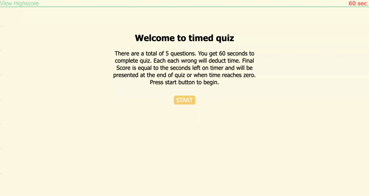

# Timed Quiz

## Description
Created a JavaScript powered timed quiz application. User has a total time of 60 seconds for 5 total questions. User will initiate the application by clicking the start button which then display the first question with multiple choice answers. Upon selecting their choice they will be alerted whether they are correct or incorrect. If user is incorrect they will be deducted 5 seconds then proceed to the next question. If they answer correctly their time is not penalized and they proceed to next question. Once they finish all questions or when time reaches zero they will be presented with their score and an input box to enter their initials. User sumbits initials and score by clicking submit button. Once clicked they will be directed to the highscores page where it will render the scores stored in local storage, if any are present. If scores render on page, user has the option to clear them by clicking the "clear scores" button or restart game by clicking "return" button to be directed to main page. 

## Links

[Deployed Site](https://delaluz12.github.io/timed-quiz)

[Site Respository](https://github.com/delaluz12/timed-quiz)

## Site Demo Video
Below is an animation of how the Timed Quiz functions. 

